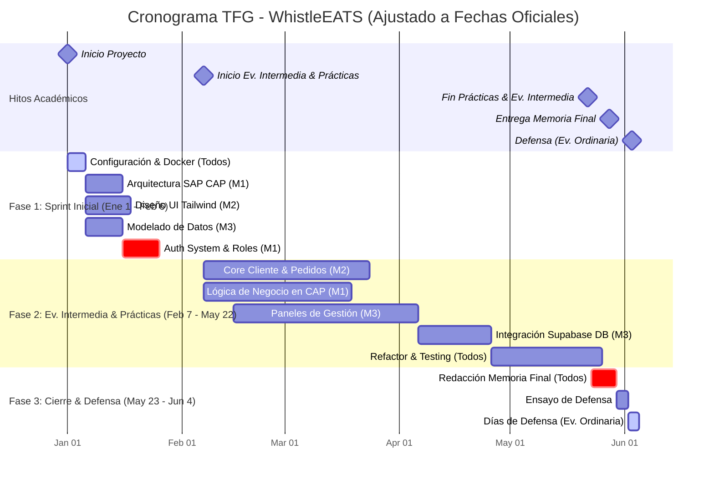

# Diagrama de Gantt - Distribución de Carga de Trabajo TFG (Calendario Oficial)

Este diagrama refleja vuestra disponibilidad real, incluyendo el periodo de **Evaluación Intermedia** coincidente con las prácticas y la **Defensa Final** en junio.

