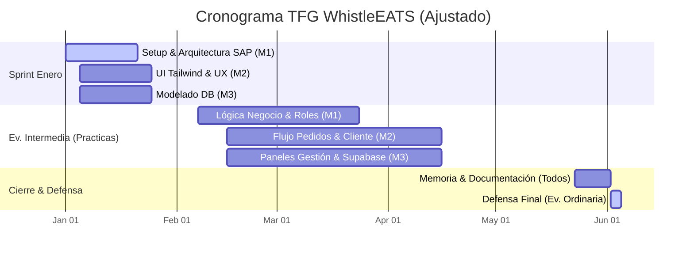

# Planificación y Distribución de Carga de Trabajo - WhistleEATS TFG

Este documento detalla la propuesta de distribución de tareas para un equipo de 3 personas, alineada con las tecnologías seleccionadas: **Angular, Supabase, TypeScript, Docker, y CSS Plano**.

## 👥 Roles Sugeridos

Para equilibrar la carga, dividiremos el trabajo en 3 perfiles "Fullstack" pero con focos distintos:

### 👤 Miembro 1: Arquitectura, Auth & Core (El "Cimiento")
**Responsabilidad Principal:** Asegurar que la base funcione, la seguridad y la gestión de usuarios.
- **Configuración Inicial:** Angular, `tsconfig` estricto, ESLint + Prettier (Reglas compartidas).
- **Docker:** Crear y mantener el `Dockerfile` y `docker-compose.yml` para el entorno de desarrollo local (si aplica) o emulación.
- **Supabase Auth:** Implementación de Login, Registro y Recuperación de clave.
- **Angular Core:** Estructura de carpetas, Layout principal (Header/Sidebar), interceptores de HTTP, y **Guards** (protección de rutas por roles).
- **CSS:** Definir las variables globales CSS (colores, fuentes, breakpoints).

### 👤 Miembro 2: Cliente & Experiencia de Usuario (El "Front-End Heavy")
**Responsabilidad Principal:** Toda la experiencia del usuario que pide comida (Cliente final).
- **Home & Exploración:** Listado de restaurantes, filtros, buscador.
- **Catálogo:** Detalle del restaurante, selección de productos, modal de opciones.
- **Carrito:** Lógica del carrito de compras (Service), persistencia local.
- **Checkout:** Flujo de confirmación de pedido y selección de dirección.
- **CSS:** Maquetación responsiva fina de estas vistas.

### 👤 Miembro 3: Operaciones & Datos (Restaurante/Rider/Admin)
**Responsabilidad Principal:** Las interfaces de gestión y la lógica de validación de datos.
- **Panel Restaurante:** CRUD de Platos, Categorías y Gestión de Menú.
- **Gestión de Pedidos:** Vista para que el restaurante acepte/rechace pedidos (Supabase Realtime).
- **Panel Rider:** Vista de pedidos listos para recoger y marcar como entregado.
- **Postman & Datos:** Crear la colección de Postman para probar las Policies (RLS) de Supabase y asegurar que un usuario no pueda ver datos de otro.

---

## 📊 Diagrama de Carga de Trabajo (Calendario Oficial)

Este cronograma está alineado con vuestras fechas académicas: del **7 de febrero al 22 de mayo (Evaluación Intermedia)** y del **2 al 4 de junio (Evaluación Ordinaria/Defensa)**.

## 🛠 Detalles Tecnológicos

### 🐳 Docker
Aunque uséis Supabase (Cloud), Docker es útil para:
- Servir la aplicación Angular en modo producción localmente para tests (`nginx` container).
- Opcional: Ejecutar Supabase localmente con `supabase start` (usa Docker) para no romper la BD de producción durante el desarrollo.
- **Tarea M1:** Asegurar que `docker compose up` levante el entorno necesario.

### 🛡️ Angular & Typescript
- **Strict Mode:** Activado en `tsconfig.json`.
- **StandAlone Components:** Usar la última arquitectura de Angular (sin NgModules explícitos si es posible).
- **Signals:** Para el manejo de estado (especialmente en el Carrito - M2).

### 🧪 Postman & Supabase
- **Tarea M3:** Debe crear una colección compartida.
- **Pruebas:** Verificar que un "Cliente" no puede crear un "Restaurante" y que un "Rider" no puede ver el carrito de otro usuario.

### 🎨 CSS Plano
Evitar librerías como Bootstrap o Tailwind significa que debéis ser organizados:
- Usar **CSS Variables** (`:root { --primary-color: #ff5722; }`).
- Usar **Flexbox** y **Grid** extensivamente.
- Definir una hoja de estilos de utilidad básica para márgenes y paddings (`utils.css`).

## 🔄 Flujo de Git (Gitgraph)
Recomendación para 3 personas:
1. `main`: Producción.
2. `develop`: Integración.
3. `feature/nombre-tarea`: Ramas temporales por tarea.

M1 es responsable de vigilar que `develop` no se rompa (Guardián del Repo).
